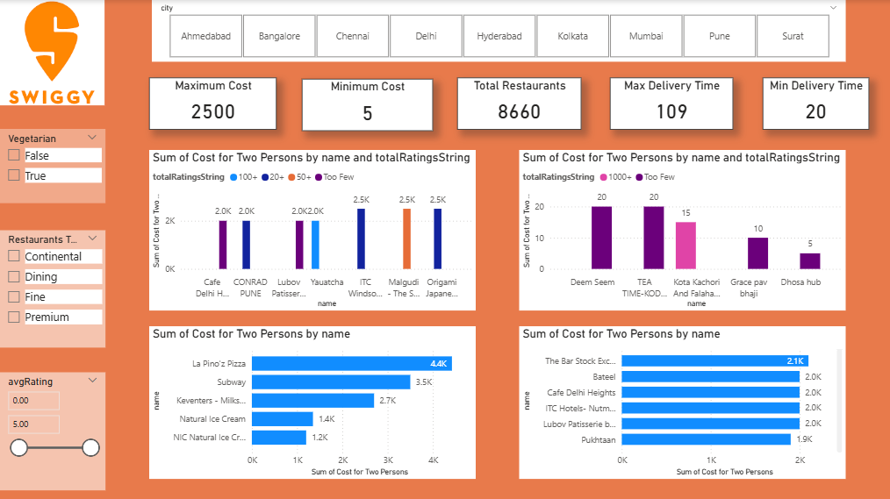

Swiggy Sales & Restaurant Analysis Dashboard

Project Overview

This project presents an interactive Power BI dashboard built to analyze Swiggy restaurant and order data. The dashboard provides insights into restaurant performance, ratings, pricing trends, and customer preferences.

Tools Used
- Power BI
- Excel/CSV
- Data Cleaning
- Data Visualization

Key Insights
- Identified top-performing restaurants based on ratings.
- Analyzed price distribution across different restaurant categories.
- Compared restaurant performance using interactive filters.
- Visualized trends through charts, KPIs, and slicers.

Dashboard Features
- Interactive filters and slicers
- KPI Cards
- Bar Charts
- Pie Charts
- Trend Analysis
- Restaurant Performance Comparison

Files Included
- Swiggy_Dashboard.pbix
- Dataset
- Dashboard Screenshots

Dashboard Preview
### Main Dashboard 

Skills Demonstrated
- Data Cleaning
- Data Transformation
- Data Visualization
- Dashboard Design
- Business Insight Generation
- Power BI Reporting
